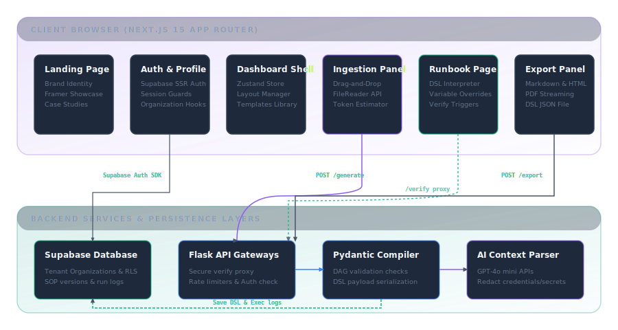

<p align="center">
  
</p>

<h1 align="center">ContextSOP</h1>

<p align="center">
  <strong>From unstructured incident noise to safe, stateful, and interactive Standard Operating Procedures.</strong>
</p>

ContextSOP transforms raw, unstructured, and chaotic engineering logs, postmortem logs, and Slack incident transcripts into **safe, stateful, and interactive Standard Operating Procedures (SOPs)**. By combining generative AI context parsing (GPT-4o) with a strict, declarative JSON-based Workflow DSL, ContextSOP eliminates manual runbook updates, parameterizes commands dynamically, and automatically verifies system states at runtime.

---

## ⚡ Live Flow Simulation

The interactive sequence below demonstrates how ContextSOP ingests unstructured log data, compiles it via our AI processing pipeline, and outputs a dynamic checklist:

<p align="center">
  
</p>

---

## 🏗️ System Architecture

The following diagram illustrates the global architecture and data flow from log ingestion to active execution and export pipelines:

<p align="center">
  
</p>

---

## 🛠️ Key Security Safeguards

1. **Execution Isolation Sandbox**
   Custom interactive React widgets generated on-the-fly are compiled and rendered using an `iframe` with a strict `sandbox="allow-scripts"` setting. Omitting `allow-same-origin` ensures that sandboxed elements have no access to host cookies, session states, or local storage.
2. **SSRF Mitigation Network Proxy**
   Automated verify checks are proxied through a specialized backend controller (`POST /api/v1/sop/verify`). Destination requests are matched against an explicit domain whitelist (`github.com`, `api.github.com`, `google.com`, `httpbin.org`, `status.payment-service.com`). Intercepts block scans directed at local or internal infrastructure.
3. **Clipboard Injection Prevention**
   Interactive command blocks sanitize copied text by stripping carriage return characters (`\r`) and leading/trailing spacing to prevent terminal command injection payloads.

---

## ⚙️ Environment Configuration

### Frontend (`frontend/.env.local`)

| Variable Name                   | Description                                    | Example / Default                  |
| ------------------------------- | ---------------------------------------------- | ---------------------------------- |
| `NEXT_PUBLIC_SUPABASE_URL`      | Endpoint url for the Supabase project          | `https://your-project.supabase.co` |
| `NEXT_PUBLIC_SUPABASE_ANON_KEY` | Public client API key for database requests    | `eyJhbG...`                        |
| `NEXT_PUBLIC_API_URL`           | Root endpoint connection for the Flask backend | `http://localhost:8080`            |

### Backend (`backend/.env`)

| Variable Name       | Description                                        | Example / Default                  |
| ------------------- | -------------------------------------------------- | ---------------------------------- |
| `FLASK_ENV`         | Mode under which the web app runs                  | `development` / `production`       |
| `FLASK_SECRET_KEY`  | Key for signing browser session objects            | `unsafe-development-key`           |
| `FRONTEND_ORIGIN`   | Allowed origin header for CORS checks              | `http://localhost:3000`            |
| `SUPABASE_URL`      | Endpoint url matching backend database auth        | `https://your-project.supabase.co` |
| `SUPABASE_ANON_KEY` | Supabase API connection key for authentication     | `eyJhbG...`                        |
| `OPENAI_API_KEY`    | API authentication credentials for LLM completions | `sk-proj-...`                      |

---

## 🗺️ Project Roadmap & Status

Below is the current phase-by-phase status mapped against the [Roadmap Specification](sources/document.md):

- `[x]` **Phase 1: Project Initialization & Monorepo Configuration**
  - Workspace configuration, path mappings, pre-commit pipelines (Husky, lint-staged), and python virtualenvs.
- `[x]` **Phase 2: High-Conversion Landing Page & Brand Identity**
  - Dark-mode first design tokens, staggered entrance transitions, and custom brand identity showcase.
- `[x]` **Phase 3: Authentication, Session Management & Multi-Tenancy**
  - Supabase SSR Auth, cookie-based session management, and Postgres RLS organizations isolation policies.
- `[x]` **Phase 4: Navigation Architecture, Shell & Layout State**
  - Responsive app layout shell, collapsible sidebars, Next.js page routing, and theme controllers.
- `[x]` **Phase 5: Upload Interface, Text Parsing & Drag-and-Drop UX**
  - Drag-and-drop log uploader, async FileReader API processing, line length safeguards, and demo case studies.
- `[x]` **Phase 6: Database Design, Schema Migration & Transactional CRUD**
  - Organizations, profiles, projects, sops, versions, and runs schemas with indexed foreign relations.
- `[x]` **Phase 7: Backend API Architecture (Flask) & Gateway Security**
  - Factory pattern blueprints, Pydantic input validation, CORS limits, and request volume limiters.
- `[x]` **Phase 8: LLM Parsing Engine, Context Extraction & Prompt Engineering**
  - Structured GPT-4o context parsing models, automated variables regex extractor, and token bounds scrubbers.
- `[x]` **Phase 9: Workflow DSL Specification & Validation Schema**
  - JSON schema definitions, version drift migration layers, and strict DAG dependency validations.
- `[x]` **Phase 10: Code Generation & Adaptive UI Extensively**
  - Dynamic React compilation sandboxes, strict iframe isolation bounds, and styling variables mapping.
- `[x]` **Phase 11: Interactive SOP Rendering Engine (DSL Interpreter)**
  - Zustand runbook state store, live parameter overrides interpolator, and whitelisted SSRF-safe checks.
- `[x]` **Phase 12: Document Versioning, History & Sync State**
  - Version history tables, side-by-side JSON visual diffs, and optimistic UI synchronization.
- `[x]` **Phase 13: SOP Templates, Parameterization & Reusable Workflows**
  - Seed library of engineering templates, validation forms wizard, and custom template builder.
- `[x]` **Phase 14: Export Engines & Interoperability**
  - High-fidelity Markdown, interactive self-contained HTML page, server-side PDF exports, and client-side JSON downloads.
- `[ ]` **Phase 15: Performance Optimization, Polish, and Production Readiness** (Planned)
  - List virtualization, asset compression, Brotli caching headers, and monitoring integration.

---

## 🚀 Local Setup

### 1. Next.js Frontend Setup
```bash
cd frontend
npm install --legacy-peer-deps
npm run dev
```

### 2. Flask Backend Setup
```bash
cd backend
python3 -m venv .venv
# On Windows PowerShell:
.venv\Scripts\activate
# On Unix:
source .venv/bin/activate

pip install -r requirements.txt
# Run using the Flask CLI:
$env:FLASK_APP="run.py"  # Windows
flask run --port=8080
```

---

## 🧪 Verification & Quality Checks

Run the following test suites locally to audit schema compatibility and formatting requirements:

### Python Backend Auditing
```bash
cd backend
$env:PYTHONPATH="."
.venv/Scripts/pytest
.venv/Scripts/ruff check .
```

### Next.js Frontend Auditing
```bash
cd frontend
npm run typecheck
npm run lint
```
